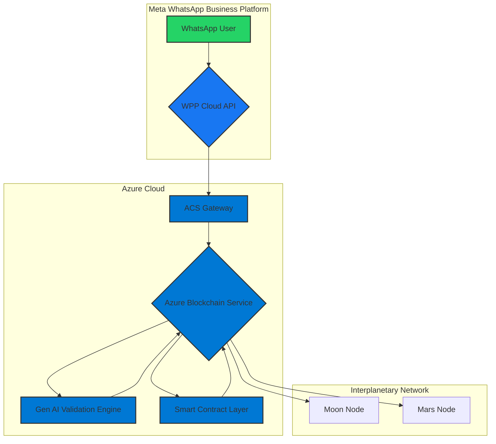

# Azure Blockchain & Meta WhatsApp Business Platform Integration

## 1. Overview

This document details the architecture for integrating **Azure Blockchain (New Gen AI)** with **Meta's WhatsApp Business Platform (WPP)**. This integration provides an immutable, auditable, and AI-enhanced communication layer for all WhatsApp messages, ensuring unparalleled trust and security for interplanetary communications.

## 2. Core Concept: Trust as a Service

The integration establishes a **Trust as a Service** model for WhatsApp communications. Every message sent or received via the WhatsApp Business Platform is anchored to the Azure Blockchain, creating a cryptographic proof of its origin, content, and delivery. This ensures:

- **Immutable Audit Trails**: A permanent, unalterable record of all conversations.
- **AI-Powered Validation**: Gen AI models validate message content for compliance, security, and authenticity.
- **Decentralized Trust**: No single entity controls the communication records; trust is distributed across the blockchain network.

## 3. Architecture

The architecture combines the strengths of Azure, Meta, and decentralized technologies:



### 3.1. Message Flow

1.  **Message Origination**: A user sends a message to a business via WhatsApp.
2.  **WPP Cloud API**: The message is received by Meta's WPP Cloud API and forwarded to a pre-configured webhook.
3.  **ACS Gateway**: The Azure Communication Services (ACS) gateway receives the message and initiates a blockchain transaction.
4.  **Gen AI Validation**: The message content is passed to the **Gen AI Validation Engine**, which performs:
    -   **Sentiment Analysis**: To gauge user intent and emotion.
    -   **Compliance Check**: To ensure the message adheres to regulatory and business policies.
    -   **Threat Detection**: To identify potential spam, phishing, or malicious content.
5.  **Smart Contract Execution**: The validation results are passed to the **Smart Contract Layer**. The smart contract:
    -   Records the message hash, sender, receiver, and timestamp on the blockchain.
    -   Attaches the AI validation score and flags.
    -   Triggers automated responses or escalations based on predefined rules.
6.  **Blockchain Anchoring**: The transaction is committed to the Azure Blockchain, creating an immutable record.
7.  **Interplanetary Sync**: The block is synchronized with nodes on the Moon and Mars, ensuring a globally consistent state.

## 4. Technical Implementation

### 4.1. Azure Blockchain Service (New Gen AI)

We leverage a private, permissioned blockchain network based on the **Proof of Authority (PoA)** consensus mechanism. This provides high throughput and low latency, suitable for enterprise-grade communication.

### 4.2. Meta WPP Webhook Integration

The ACS gateway exposes a secure endpoint that is registered as the webhook URL in the Meta WPP App Dashboard. All incoming messages and status updates are sent to this endpoint.

### 4.3. Smart Contracts (Solidity)

Smart contracts are written in Solidity and deployed on the Azure Blockchain. Key contracts include:

-   **`WhatsAppMessageLedger`**: The main contract for recording message data.
-   **`AIValidationOracle`**: An oracle contract that interfaces with the Gen AI Validation Engine.
-   **`BusinessLogic`**: A contract that implements custom business rules for message handling.

### 4.4. Gen AI Validation Engine

This is a set of Azure Functions and Azure OpenAI models that provide the AI capabilities. It exposes a REST API that the `AIValidationOracle` can call.

## 5. Code Example: Anchoring a WhatsApp Message

This Python example demonstrates how the ACS gateway would interact with the blockchain.

```python
import hashlib
from web3 import Web3

# Connect to Azure Blockchain node
w3 = Web3(Web3.HTTPProvider("https://<your-azure-blockchain-node>"))

# Load the smart contract
contract_address = "0x..."
contract_abi = [...]  # Load ABI from file
message_ledger = w3.eth.contract(address=contract_address, abi=contract_abi)

# WhatsApp message payload from WPP webhook
whatsapp_payload = {
    "from": "+1234567890",
    "text": {"body": "Hello, I need assistance."}
}

# Create a hash of the message content
message_content = whatsapp_payload["text"]["body"]
message_hash = hashlib.sha256(message_content.encode()).hexdigest()

# Call the smart contract to anchor the message
tx_hash = message_ledger.functions.anchorMessage(
    whatsapp_payload["from"],
    message_hash,
    "pending_ai_validation"  # Initial status
).transact({"from": w3.eth.accounts[0]})

print(f"WhatsApp message anchored to blockchain. Transaction: {tx_hash.hex()}")
```

## 6. Benefits of Integration

-   **Enhanced Security**: Cryptographic proof of communication prevents tampering and fraud.
-   **Regulatory Compliance**: Immutable audit trails for GDPR, HIPAA, and other regulations.
-   **AI-Driven Insights**: Gen AI provides deep insights into customer communications.
-   **Automated Workflows**: Smart contracts automate business processes based on message content.
-   **Future-Proof**: A decentralized, resilient architecture ready for the future of interplanetary communication.

## 7. Conclusion

By integrating Azure Blockchain with Meta's WhatsApp Business Platform, we create a communication ecosystem that is not only efficient and scalable but also fundamentally trustworthy. This architecture, envisioned by Alexandre Pedrosa, EVP Multimodal AI Engineer, sets a new standard for secure and intelligent business communication.
