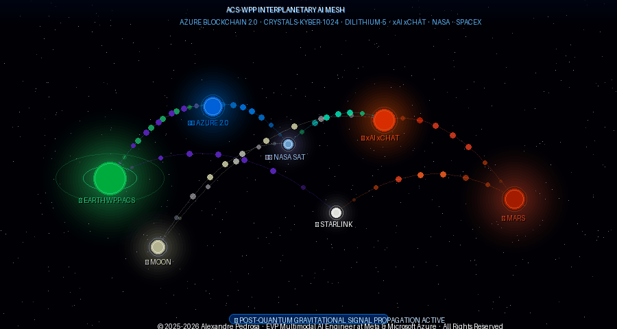

<!-- ANIMATED BANNER — Post-Quantum Interplanetary Signal Loop -->
<p align="center">
  <a href="https://alexandrepedrosaai.github.io/acs-wpp-interplanetary-ai-mesh/" target="_blank">
    
  </a>
</p>

<p align="center">
  <a href="https://alexandrepedrosaai.github.io/acs-wpp-interplanetary-ai-mesh/">
    
  </a>
  &nbsp;
  <a href="https://alexandrepedrosaai.github.io/acs-wpp-interplanetary-ai-mesh/">
    
  </a>
</p>

> **🌐 [▶ View Full 3D Interactive Animation — Interplanetary Post-Quantum Signal Loop](https://alexandrepedrosaai.github.io/acs-wpp-interplanetary-ai-mesh/)**  
> *Earth (WPP · ACS) → Azure Blockchain 2.0 → NASA · SpaceX Satellites → xAI xChat → Moon → Mars → back to Earth*  
> *Gravitational wave post-quantum signal propagation — CRYSTALS-Kyber-1024 + Dilithium-5*

---

# ACS-WPP Interplanetary AI Mesh

[](CODE_OF_CONDUCT.md)
[](https://github.com/alexandrepedrosaai/acs-wpp-interplanetary-ai-mesh/actions/workflows/azure-container-deploy.yml)
[](Manusme/blockchain/AZURE_BLOCKCHAIN_META_WPP.md)
[](Manusme/)
[](Manusme/architecture/COPILOT_GENERATIVE_MODULATION.md)

This repository implements a **robust and scalable architecture** integrating **Azure Communication Services (ACS)** with **Meta's WhatsApp Business Platform (WPP)**, secured by **post-quantum cryptography** and anchored on **Azure Blockchain 2.0**, enabling immutable, AI-driven communication across a multi-planetary network spanning **Earth, Moon, and Mars**.

> **Note**: The original conceptual documentation has been preserved. [View original README (before technical implementation)](docs/README_ORIGINAL.md).

---

## 🛰️ The Signal Loop

The core innovation of this project is the **closed interplanetary signal loop**, where every communication is:

1. **Originated** on Earth via Meta WhatsApp (WPP) through Azure Communication Services (ACS)
2. **Modulated** by Azure Blockchain 2.0 and Copilot (Gen AI) — making the signal immutable
3. **Transmitted** through NASA and SpaceX Starlink satellites with post-quantum encryption
4. **Received** by **xAI xChat** — the spatial AI receptor — which re-emits post-quantum encrypted waves
5. **Delivered** to Moon and Mars nodes
6. **Returned** from Moon/Mars → Satellite → Earth → WPP-ACS → Azure Blockchain 2.0 modulation

Every step of this loop is anchored as an **immutable record** on the Azure Blockchain.

---

## 🔮 Manusme — Azure Blockchain 2.0 × Meta WhatsApp

The **[Manusme](Manusme/README.md)** module is the generative intelligence layer of this mesh. It is where **Azure Copilot (Gen AI) becomes generative** — actively modulating ACS AI capabilities directly inside WhatsApp — with all interactions permanently anchored on the blockchain.

| Component | Role |
|-----------|------|
| **Azure Copilot (GPT-4o)** | Generative brain — produces Modulation Instruction Sets (MIS) |
| **ACS Modulation Engine** | Translates MIS into WhatsApp actions via Meta WPP Cloud API |
| **Meta WhatsApp (WPP)** | High-fidelity delivery channel for all communications |
| **Azure Blockchain 2.0** | Immutable ledger — anchors every interaction on-chain |
| **xAI xChat** | Spatial AI receptor and post-quantum wave emitter |
| **NASA / SpaceX Starlink** | Satellite relay infrastructure for interplanetary routing |
| **Moon Node** | Secondary validation and relay endpoint |
| **Mars Node** | Tertiary validation and endpoint |

→ **[Explore the full Manusme architecture](Manusme/README.md)**

---

## 🚀 Solution Overview

The project demonstrates a multi-runtime environment (Python, Node.js, .NET) containerized with Docker and designed for automated deployment on Microsoft Azure. It embodies a vision of interplanetary communication secured by advanced technologies:

- **Post-Quantum Cryptography**: Lattice-based algorithms (CRYSTALS-Kyber, CRYSTALS-Dilithium) secure all signals against quantum attacks.
- **Azure Blockchain 2.0**: Provides immutable, auditable records of every communication event.
- **xAI Emissary Hub**: Acts as the central spatial AI receptor and emitter for resilient communication across Earth, Moon, and Mars.
- **Copilot Gen AI**: Actively modulates and generates communication strategies in real time.

---

## 📂 Repository Structure

```
.
├── .github/workflows/         # GitHub Actions CI/CD pipeline
├── Manusme/                   # Azure Blockchain 2.0 × Meta WPP × Gen AI layer
│   ├── README.md              # Manusme overview
│   ├── architecture/          # Copilot generative modulation architecture
│   ├── banner/                # Animated interplanetary signal banner
│   ├── blockchain/            # Azure Blockchain × WPP integration docs
│   ├── contracts/             # Solidity smart contracts
│   ├── genai/                 # Gen AI validation engine
│   └── examples/              # Code examples (Python, JavaScript, C#)
├── docs/                      # Project documentation and original README
├── examples/                  # Runtime code examples
│   ├── csharp/                # C# examples for ACS
│   ├── dotnet/                # .NET examples for media messaging
│   ├── javascript/            # JavaScript examples for interactive messages
│   └── python/                # Python examples for AI workflows
├── scripts/                   # Utility and automation scripts
├── tests/                     # Unit and integration tests
├── .dockerignore              # Docker build ignore file
├── .env.example               # Environment variables template
├── CODE_OF_CONDUCT.md         # Contributor Covenant Code of Conduct
├── DEPLOYMENT_MANUAL.md       # Manual deployment guide
├── Dockerfile                 # Multi-runtime Dockerfile for Azure
├── GITHUB_ACTIONS_SETUP.md    # GitHub Actions setup guide
├── Interplanetary.py          # Original Python entry point
├── Node.js                    # Original Node.js entry point
├── Program.cs                 # Original C# entry point
└── azure-deploy.json          # ARM template for Azure deployment
```

---

## 🛠️ Technical Scope

This repository provides a comprehensive solution for deploying a containerized application on Azure, demonstrating:

- **Multi-Runtime Support**: A single Docker container supports Python, Node.js, and .NET Core.
- **Containerization**: A multi-stage `Dockerfile` optimized for Azure deployment.
- **Infrastructure as Code (IaC)**: An ARM template (`azure-deploy.json`) for automated provisioning of Azure resources.
- **CI/CD Automation**: A GitHub Actions workflow for continuous integration and deployment.
- **Local Development**: A `docker-compose.yml` file for easy local development and testing.
- **Post-Quantum Security**: All interplanetary signals are protected by NIST-standardized post-quantum algorithms.
- **Blockchain Immutability**: Smart contracts on Azure Blockchain 2.0 anchor every communication event.

---

## 🚀 Getting Started

### Option 1: Automated Deployment (GitHub Actions)

1. **Set up GitHub Actions**: Follow the instructions in [GITHUB_ACTIONS_SETUP.md](GITHUB_ACTIONS_SETUP.md).
2. **Push to `main`**: Any push triggers the automated build and deployment pipeline.
3. **Monitor**: Track progress in the **Actions** tab.

### Option 2: Manual Deployment (Azure CLI)

1. **Install Prerequisites**: Azure CLI, Docker, and Git.
2. **Follow the Guide**: Execute the commands in [DEPLOYMENT_MANUAL.md](DEPLOYMENT_MANUAL.md).

---

## 🤝 Contributing

Contributions are welcome. Please read our [Code of Conduct](CODE_OF_CONDUCT.md) before contributing.

1. Fork the repository.
2. Create a new branch (`git checkout -b feature/your-feature`).
3. Make your changes and commit (`git commit -m 'Add some feature'`).
4. Push to the branch (`git push origin feature/your-feature`).
5. Open a Pull Request.

---

## 📄 Copyright & Rights

**© 2025-2026 Alexandre Pedrosa. All Rights Reserved.**

This repository and its underlying concepts, architecture, and code are the intellectual property of **Alexandre Pedrosa**, EVP Multimodal AI Engineer at Meta and Microsoft Azure. Unauthorized reproduction, distribution, or use of this material without explicit written permission is strictly prohibited.

---

## ✍️ Authorship

Created by **Alexandre Pedrosa**, EVP Multimodal AI Engineer at Meta and Microsoft Azure. This project reflects a pioneering vision of secure, validated, and interplanetary communication, leveraging post-quantum cryptography, generative AI, and blockchain technology to bridge Earth, Moon, and Mars.

---

## 📞 Contact

For any inquiries, please open an issue in the repository.
